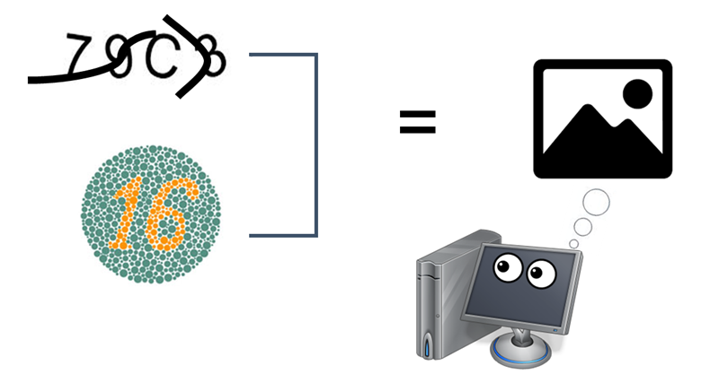

## **OCR Model Review** 
## **(About reCAPTCHA)**
 
발표영상 
https://www.youtube.com/watch?v=Tg0FYaTWCc4
  

#### 파일 설명
    original_model : 기존 OCR model의 소스코드
                     (reCAPTCHA를 세로형태로 해석)
    reverse_model : 기존 모델의 학습자료를
                    좌우반전하여 학습하는 모델 코드
    horizon_model : 기존 모델의 학습자료를
                    좌측 90º회전하여 학습하는 모델 코드
    images : README 첨부 사진
 

### **사용한 데이터**
https://github.com/AakashKumarNain/CaptchaCracker/raw/master/captcha_images_v2.zip 
봇을 필터링하기 위해 도입된 reCAPTCHA에서 사용되는 사진모음 
(파일명으로 라벨링된 image)
  
Data preview

 
 

### **프로젝트 목적**

사이트에 접속을 시도하는 주체가 봇인 경우(사람이 아닌경우)를 
필터링 하기 위해 도입된 reCAPTCHA 데이터를 기반으로 
OCR Model을 학습시키며 모델의 작동원리를 이해하고, 
학습 수준에 따라 봇으로 간파가 가능 한지 시사한다. 
  

###

### **프로젝트 진행 방향** 
**1. reCAPTCHA의 원리** 

**2. OCR Model에 관하여** 
　- 2.1 RNN Model 
　- 2.2 CTC-Algorithm 
　- 2.3 특징 추출 방법 

**3. OCR Model 튜닝 **
　- 3.1 Horizon OCR model 
　- 3.2 Original OCR Model 
　- 3.3 Reverse OCR Model 

**4. 성능 확인 **

**5. 결론 **

 

### **1. reCAPTCHA의 원리 **
> 컴퓨터는 image안의 글자를 판별하지 못하고, image자체로 본다.  
 

0과 1을 처리하는 컴퓨터에게 비정형 데이터인 image는
 
**몇가지 글자를 품고 있던 상관 없이** 
**"그림"** 이라는 한가지로 인식되기 때문에 
학습된 모델이 내제되어 있지 않은 컴퓨터에게 reCAPTCHA란 
**단순히 그림을 멀뚱멀뚱 쳐다보고 있는 것.**
  
ex) 세계적인 화가의 그림이라도 교양이 부족한 일반인이 본다면,  
　　해석을 하지 못하고 바라만 보는 격. 
 
**즉, image속 글자를 인식할 수 있는 인간이 직접 통과해야 하는 구조를 활용한 프로그램**  
**그렇다면, 글자를 인식할 수 있는 프로그램이 있다면, 봇으로 Pass가 가능한가?**
 

 

### **2. OCR Model에 관하여 **
> OCR Model = RNN + CTC Algorithm  

 

#### **2.1　RNN Model**
> 여러 텍스트가 조합된 image는 CNN만으로 유추할 수 없기에,  현재학습과 과거학습을 연결시켜 주는 양방향 모델 RNN이 필요  

  
CNN만 활용한다면 빨간 박스 부분이 l같지만,  
주변 정보를 파악 수 있는 RNN을 활용하여 m인것을 확인
 

 

#### **2.2　CTC-Algorithm**
> 조각 형식으로 파악된 텍스트를 조합하는 알고리즘  

  
RNN만으론 어디부터 어디까지 h인지 알 수 없기에 관계정렬이 필요.   
분할된 영역에서 이미지가 같은 특징에 대해 **조건부 확률**을 
계산하여 **경우의 수를 나열**하고,  
종합하여 **중복된 글자들로 최종 텍스트를 획득** 
 

 

#### **2.3　특징 추출 방법**
> 조각 형식으로 파악하는 방법(filtering)  
**기본 reCAPTCHA image를 filtering으로 파악하는 영상**
  
좌측에서 우측으로 진행하기에 텍스트 하나에 집중되지 않고 전체적인 부분을 파악 (2의 윗부분 > b의 윗부분)   
**기본 image를 우측으로 90º회전후 filtering하며 파악하는 영상**
  
좌측에서 우측으로 진행되는것은 같으나, image를 회전했기에 한 글자에 대해 충분히 파악 후 다음 글자로 이동 (2 > b)  

 

### **3. OCR Model 튜닝 **
> image 형태에 따라 filtering 진행이 달라지는데, 모델의 정확도도 다른가?

 

#### **3.1　Horizon OCR model**
> filtering 방법에 차별화를 위해 가로형태인 기본 reCAPTCHA image로 학습 진행 (horizontal_Image)  
**시행 결과**
 
**텍스트의 둥근 부분이 있을 시 최대한 매칭해 주려는 모습이나, 뒷배경에 있는 noise까지 텍스트로 반영하려는** **모습이 식별되며, Unknown을 추출하기도 함.**
 

 

#### **3.2　Original OCR Model**
> 공식 OCR Model의 코드는 기본 image를 우측으로 90º회전 후 학습 진행 (Vertical_Image)  
**시행 결과**
 
**대부분의 image를 올바르게 유추**
 

 

#### **3.3　Reverse OCR Model**
> 세로형식이라는 결은 유지하여 filtering 방법을 통일하되, image를 좌우 반전하여 학습 진행 (Vertical_inverted_Image)  
**시행 결과**
 
**대부분의 image를 올바르게 유추**
 

 

### **4. 성능 확인 **
> **Horizon OCR Model**
  
Epochs가 64회로, 빠르게 학습이 되었으나, 오류를 범한 정도인 loss값이 소숫점 자리로 진입하지 못함.  

> **Origin OCR Model**
  
Epochs가 100회를 넘겨 가장 느리게 학습이 되었으나, 오류를 범한 정도인 loss값이 소숫점 자리로 진입  

> **Reverse OCR Model**
  
Epochs가 약 90회로 Origin Model보다 빠르게 학습되었고, 오류를 범한 정도인 loss값 감소 (모델 성능 향상) 

 

> 성능 비교 상에선 Reverse OCR Model이 Origin OCR Model보다 학습속도 면에서 성능이 우수했으나, 
학습 이전, 데이터를 반전시키는 **전처리 시간**이 압도적으로 
길었기에, **10 Epochs 이상의 시간이 소요**되었다.  
또한, Reverse OCR Model이 Origin OCR Model보다 
정확도 면까지 성능이 우수했으나, **loss값**에서 **두 모델 모두 낮은값**을 기록 하였다고 본다면,   
전처리 시간까지 고려했을때, 
**Keras team의 공식모델인 Origin OCR Model이 효율면에서** **우수**하다고 볼 수 있다. 

 

### **5. 결론** 
> 학습된 모델이 예측한 결과물을 보았을 때, 
reCAPTCHA를 인식하고 입력란에 예측값을 기입하는 프로그램이 수반된다면 **봇임에도 불구하고**, 학습된 모델이 있기에, **필터링 되지 않고 통과 할 수 있음**을 간접적으로 알 수 있다.

 

참고문헌 : keras-team Original OCR Model 
https://github.com/keras-team/keras-io/blob/master/examples/vision/captcha_ocr.py
